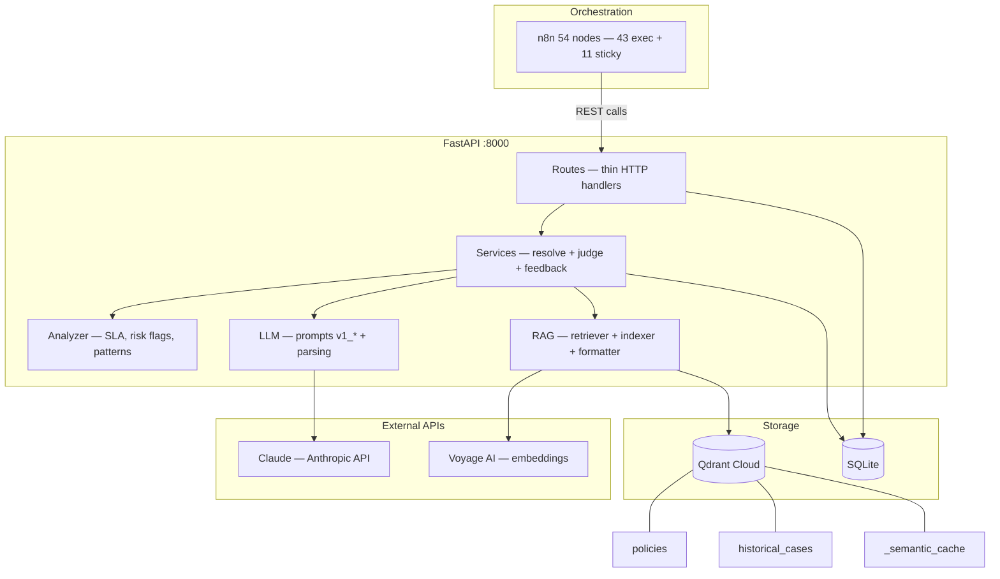

# CIRI Chargeback Agent


Intelligent chargeback resolution agent built for the CIRI (Continuous Improvement & Risk Intelligence) technical evaluation. The system investigates chargeback cases end-to-end: it retrieves applicable policies via RAG, evaluates them against the transaction, synthesizes a resolution, and self-improves through a Judge-gated feedback loop.

> **Live Demo:** [Test Panel on Render](https://ciri-chargeback-agent.onrender.com/panel) — interactive UI to run chargeback investigations without local setup.

---

## Architecture



**Key principle:** n8n is the explicit orchestrator — every step is a named, visible node. No AI Agent black box. Two entry points (Webhook + Form Trigger) share the same flow. Native n8n nodes handle validation, SLA, merchant/client flags, guardrail visibility, and judge score gating. All domain logic, RAG, and LLM calls live in FastAPI services.

---

## Prerequisites

| Dependency | Version | Notes |
|---|---|---|
| Docker + Docker Compose | >= 24.x | Runs Qdrant, FastAPI, n8n |
| Python | 3.11+ | Only needed outside Docker |
| Anthropic API Key | — | Claude Haiku (default model) |
| Voyage AI API Key | — | Free tier at https://dash.voyageai.com/ |
| Langfuse account | — | Optional; for observability |

---

## Quick Start

### 1. Clone and configure

```bash
git clone <repo-url>
cd quest_ML
cp .env.example .env
# Edit .env — set CB_ANTHROPIC_API_KEY and CB_VOYAGE_API_KEY at minimum
```

### 2. Start all services

```bash
docker-compose up -d
```

Services started:
- Qdrant vector DB → http://localhost:6333
- FastAPI tools API → http://localhost:8000
- n8n orchestrator → http://localhost:5678

### 3. Seed database and vector store

```bash
docker-compose exec api python -m app.seed_data
```

This loads 100 transactions, 60 historical cases, 17 policies, and 150 logs into SQLite, then indexes policies and cases into Qdrant.

### 4. Verify health

```bash
curl http://localhost:8000/health
# {"status":"healthy","sqlite":"ok","qdrant":"ok","collections":{"policies":17,"historical_cases":60,"_semantic_cache":0}}
```

### 5. Import n8n workflow

Navigate to http://localhost:5678, import `n8n/workflow_ciri_agent.json` (main workflow, 54 nodes) and `n8n/workflow_ciri_errors.json` (error handler). Activate both workflows. Set the main workflow's Error Workflow to "CIRI — Error Handler" in Settings.

### 6. Run a demo analysis

```bash
# Via n8n webhook (explicit orchestration — 54 nodes)
curl -s -X POST http://localhost:5678/webhook/chargeback-agent \
  -H "Content-Type: application/json" \
  -d '{"transaction_id": "TXN-00051", "motivo": "No reconoce la compra"}' \
  -o report_blocker.html

# Via n8n form trigger (native browser form)
# http://localhost:5678/form/chargeback-form

# Or via direct FastAPI panel (works without n8n)
# http://localhost:8000/panel
```

---

## API Reference

All endpoints are prefixed with `/api/`. Full interactive docs: http://localhost:8000/docs

### Core analysis

| Method | Endpoint | Description |
|---|---|---|
| `POST` | `/api/analyze/resolve` | Policy evaluation + resolution synthesis + guardrails |
| `POST` | `/api/analyze/judge` | LLM-as-Judge quality evaluation (5 criteria, 1–10 each) |

### Transactions

| Method | Endpoint | Description |
|---|---|---|
| `GET` | `/api/transactions/{id}` | Get transaction by ID |
| `GET` | `/api/logs/{tx_id}` | Get all event logs for a transaction |
| `GET` | `/api/clients/{id}/history` | Chargeback history for the client |

### Policies (CRUD + semantic search)

| Method | Endpoint | Description |
|---|---|---|
| `GET` | `/api/policies/` | List all policies |
| `GET` | `/api/policies/search` | Semantic search over Qdrant |
| `GET` | `/api/policies/{code}` | Get policy by code |
| `POST` | `/api/policies/` | Create policy → auto-indexed in Qdrant |
| `PUT` | `/api/policies/{code}` | Update policy → auto-re-indexed in Qdrant |
| `DELETE` | `/api/policies/{code}` | Delete policy → removed from Qdrant |

### Cases and merchants

| Method | Endpoint | Description |
|---|---|---|
| `GET` | `/api/cases/similar` | Semantic search for similar historical cases |
| `GET` | `/api/merchants/{name}/risk` | Merchant risk profile |
| `POST` | `/api/sla/check` | SLA compliance check |

### Feedback, reports, and cache

| Method | Endpoint | Description |
|---|---|---|
| `POST` | `/api/feedback` | Submit analyst feedback; auto-indexes if judge_score >= 8.0 |
| `POST` | `/api/reports/html` | Generate HTML resolution report (Jinja2) |
| `GET` | `/api/cache/lookup` | Idempotency cache check (SQLite exact-match) |

---

## Configuration

All settings are read from `.env` with the `CB_` prefix (powered by pydantic-settings).

```env
# Required
CB_ANTHROPIC_API_KEY=sk-ant-...
CB_VOYAGE_API_KEY=pa-...

# LLM (optional — defaults shown)
CB_LLM_MODEL=claude-haiku-4-5-20251001
CB_LLM_TEMPERATURE=0.3
CB_LLM_MAX_TOKENS=4096

# Qdrant (optional)
CB_QDRANT_URL=http://localhost:6333
CB_QDRANT_POLICIES_COLLECTION=policies
CB_QDRANT_CASES_COLLECTION=historical_cases
CB_QDRANT_CACHE_COLLECTION=_semantic_cache

# Embeddings (optional)
CB_EMBEDDING_MODEL=voyage-multilingual-2
CB_EMBEDDING_DIM=1024

# SQLite (optional)
CB_SQLITE_PATH=data/chargeback.db
CB_DATA_FILE_PATH=data/Similación_dataset_contracargos_.xlsx

# Semantic cache (optional)
CB_SEMANTIC_CACHE_ENABLED=true
CB_SEMANTIC_CACHE_THRESHOLD=0.92

# Auto-improvement gate (optional)
CB_JUDGE_AUTO_INDEX_THRESHOLD=8.0

# Langfuse observability (optional)
CB_LANGFUSE_ENABLED=false
CB_LANGFUSE_PUBLIC_KEY=pk-lf-...
CB_LANGFUSE_SECRET_KEY=sk-lf-...
CB_LANGFUSE_HOST=https://cloud.langfuse.com
```

---

## Testing

```bash
# All tests (from project root, outside Docker)
python -m pytest tests/ -v --tb=short

# Unit tests only (no external services)
python -m pytest tests/unit/ -v

# Integration tests
python -m pytest tests/integration/ -v

# Single test file
python -m pytest tests/unit/test_analysis.py -v

# With coverage
python -m pytest tests/ --cov=api.app --cov-report=term-missing
```

203 tests across 11 test files (unit + integration):

```
tests/
  conftest.py                        # MockLLMClient, sample data, in-memory SQLite
  unit/
    test_data_loader.py              # Excel → SQLite data loading
    test_rag_retriever.py            # QueryBuilder enrichment rules
    test_analysis.py                 # SLA, error patterns, merchant risk, client flags
    test_guardrails.py               # Post-LLM guardrail validation
    test_guardrails_edge.py          # Edge cases: boundaries, combined warnings
    test_db.py                       # Database layer: CRUD, stats, cache
    test_indexer.py                  # QdrantIndexer with mocked client
    test_formatter.py                # RAG formatter output verification
    test_report_generator.py         # Jinja2 HTML rendering + XSS prevention
  integration/
    test_full_flow.py                # Full resolve → judge → feedback → report cycle
    test_policies_crud.py            # Policy CRUD + Qdrant re-indexing
    test_routes.py                   # Route-level integration: SLA, cache, health
```

---

## Design Decisions

9 documented decisions with Context, Rationale, Trade-offs, and Production considerations. See [`docs/decisions.md`](docs/decisions.md) for the complete analysis. Key highlights:

| # | Decision | Why |
|---|----------|-----|
| 1 | n8n explicit orchestration (not AI Agent) | Full auditability for regulated fintech — every step visible |
| 2 | Policies as data, not code | Zero-downtime updates via REST API, LLM evaluates dynamically |
| 3 | Deterministic QueryBuilder | Free, reproducible, debuggable RAG queries — no LLM needed |
| 4 | Service layer architecture | Routes thin (~20 lines), testable layers, swappable implementations |
| 5 | Voyage AI embeddings (1024d) | Top-3 Spanish multilingual on MTEB, generous free tier |
| 6 | SQLite over Postgres | Self-contained for evaluation, clean migration path |
| 7 | Post-LLM guardrails | Catches APPROVE+BLOCKER hallucinations, compensation caps |
| 8 | Judge through FastAPI | Consistent prompt versioning and Langfuse observability |
| 9 | Semantic cache in Qdrant | ~20% LLM cost reduction for recurring patterns |

---

## Project Structure

```
quest_ML/
  api/
    app/
      config.py             # pydantic-settings (CB_ prefix)
      main.py               # FastAPI app, CORS, router registration
      dependencies.py       # lifespan DI, all services initialized once
      domain/
        models.py           # Pydantic models with Field validators
        enums.py            # StrEnums: VerdictType, Severity, ErrorPattern, etc.
        constants.py        # 27+ centralized thresholds and limits
      services/
        resolution.py       # ResolutionService: resolve + judge + guardrails
        feedback.py         # FeedbackService: feedback + auto-indexing
      rag/
        indexer.py          # QdrantIndexer (batch + single point, uuid5 IDs)
        retriever.py        # QdrantRetriever + QueryBuilder (deterministic)
        updater.py          # RAGUpdater (hooks for CRUD + feedback)
        formatter.py        # Shared formatters for LLM context
        embedder.py         # Voyage AI embedder (lazy, thread-safe)
      llm/
        client.py           # Protocol LLMClient + AnthropicClient
        parsing.py          # parse_json_safely (LLM response parsing)
        prompts/
          v1_policy_eval.py
          v1_resolution.py
          v1_judge.py
          v1_log_analysis.py
      analysis/
        analyzer.py         # SLA, error patterns, merchant risk, client flags
      routes/               # Thin handlers (~20 lines each)
      reports/
        generator.py        # Jinja2 → HTML
        templates/
          case_report.html  # 9 sections + conditional HITL form
          test_panel.html   # Interactive test panel
      observability/
        tracer.py           # LangfuseTracer + NoOpTracer (Protocol)
      data/
        db.py               # SQLite access (pure data, no business logic)
        loader.py           # Excel → SQLite (handles row 1 skip + emoji sheets)
  n8n/
    workflow_ciri_agent.json  # Main workflow (54 nodes: 43 exec + 11 sticky)
    workflow_ciri_errors.json # Error handler workflow (separate by n8n design)
  scripts/
    seed_data.py              # Excel → SQLite + Qdrant seeding
    update_workflow.py        # Script to add native n8n nodes to workflow JSON
  tests/
  docs/
    architecture.md
    decisions.md
    prompts.md
    rag_explanation.md
    mejora_continua.md
    demo_scenarios.md
  docker-compose.yml
  .env.example
```

---

## Demo Scenarios

See [`docs/demo_scenarios.md`](docs/demo_scenarios.md) for 3 end-to-end scenarios:

| TXN | Scenario | Expected |
|---|---|---|
| TXN-00051 | Cripto + fraud_score=8 | BLOCKER → auto-REJECT |
| TXN-00042 | Credit Visa + score=4 + VIP | HIGH → HITL (analyst review) |
| TXN-00089 | Debit Visa + USA | WARNING (extended SLA) |

---

## Documentation

| Document | Description |
|---|---|
| [`docs/architecture.md`](docs/architecture.md) | System architecture, n8n flow, ADRs |
| [`docs/decisions.md`](docs/decisions.md) | 9 technical decisions with rationale and trade-offs |
| [`docs/prompts.md`](docs/prompts.md) | All 4 versioned prompts with I/O specs |
| [`docs/rag_explanation.md`](docs/rag_explanation.md) | RAG strategy, collections, QueryBuilder |
| [`docs/mejora_continua.md`](docs/mejora_continua.md) | Feedback loop, Judge gate, guardrails |
| [`docs/demo_scenarios.md`](docs/demo_scenarios.md) | 3 demo scenarios with curl commands |
