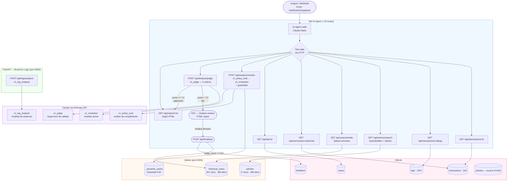

# Architecture — CIRI Chargeback Agent

## Table of Contents

1. [System Overview](#system-overview)
2. [Full Flowchart](#full-flowchart)
3. [Data Flow Description](#data-flow-description)
4. [Architectural Decision Records](#architectural-decision-records)

---

## System Overview

The CIRI Chargeback Agent is a multi-service system where each layer has a single responsibility:

| Layer | Technology | Responsibility |
|---|---|---|
| Orchestration | n8n AI Agent | WHAT to do and WHEN — webhook entry, tool sequencing, HITL routing |
| Business logic | FastAPI | HOW — policy retrieval, resolution synthesis, guardrails, feedback |
| Semantic store | Qdrant | Unstructured truth — policies, historical cases, semantic cache |
| Structured store | SQLite | Relational truth — transactions, logs, feedback, policy audit trail |
| LLM | Claude Haiku | Policy evaluation, resolution, quality judge, log analysis |
| Observability | Langfuse | Token cost, latency, judge scores, cache hit rate |

---

## Full Flowchart



---

## Data Flow Description

### Phase 1: Entry

A chargeback investigation starts when a webhook fires (analyst submits a transaction ID, or n8n polls for new cases). The n8n AI Agent receives the payload and begins autonomously calling FastAPI tools in sequence.

### Phase 2: Context assembly (parallel tool calls)

The agent calls four endpoints in parallel to gather all evidence:

1. `GET /api/transactions/{id}` — structured transaction data from SQLite (amount, merchant, country, payment method, fraud_score, client_vip)
2. `GET /api/transactions/{id}/logs` — all event logs for the transaction
3. `GET /api/policies/search` — semantic search over Qdrant `policies` collection; the QueryBuilder enriches the query deterministically before embedding
4. `GET /api/cases/similar` — top-5 semantically similar historical cases from Qdrant `historical_cases`

Additional context: `GET /api/merchants/{name}/risk` and `GET /api/sla/{id}`.

### Phase 3: Log analysis (optional)

If the log count exceeds a threshold or contains ERROR/WARN events, the agent calls `POST /api/logs/analyze`, which runs `v1_log_analysis` prompt through Claude to detect 9 anomaly patterns (TIMEOUT_RETRY, FRAUD_ALERT, DOUBLE_CHARGE_DETECT, SLA_BREACH, etc.).

### Phase 4: Resolution synthesis

`POST /api/analyze/resolve` is the main pipeline endpoint. It executes internally in five steps:

1. Formats the policies retrieved from Qdrant for LLM context
2. Calls `v1_policy_eval` → array of `{policy_code, verdict, reasoning, requires_human_review}`
3. Calls `v1_resolution` with transaction + policy verdicts + precedents + logs + merchant risk + client history → Resolution JSON
4. Applies post-LLM guardrails (APPROVE+BLOCKER → force REJECT; compensation cap; confidence check)
5. Returns the final Resolution with any guardrail warnings appended

Before calling Claude, the endpoint checks the `_semantic_cache` collection (threshold 0.92). If a near-identical query is cached, it returns the cached response immediately.

### Phase 5: Quality gate

`POST /api/analyze/judge` evaluates the resolution across 5 criteria (1.0–10.0 each). `overall_score >= 7.0` → approved. `overall_score < 7.0` → HITL required; the workflow routes to the analyst review step in n8n.

### Phase 6: Human-in-the-loop (conditional)

If the Judge rejects the resolution quality, n8n generates an HTML report (`GET /api/reports/{id}`) and waits for the analyst to review and submit feedback via `POST /api/feedback/`.

### Phase 7: Auto-improvement

`POST /api/feedback/` saves the analyst decision to SQLite. If `judge_score >= 8.0`, it calls `RAGUpdater.on_case_resolved()`, which indexes the resolved case as a new precedent in Qdrant `historical_cases`. Future similar cases will now retrieve this case as a high-quality example.

---

## Architectural Decision Records

### ADR-001: n8n as Orchestrator

**Status:** Accepted

**Context:** The system needs an orchestration layer that can handle webhooks, sequence multiple tool calls, manage conditional branching (HITL vs. auto-approve), and provide a visual audit trail for non-technical stakeholders.

**Decision:** Use n8n AI Agent as the sole orchestrator. The n8n workflow contains ~19 nodes: webhook trigger, AI Agent node (Claude with tool calling enabled), individual HTTP Request nodes wired as tools, and a conditional HITL branch.

**Consequences:**
- n8n provides a visual representation of the full investigation flow, useful for demo and audit
- The AI Agent node autonomously decides which tools to call and in what order, based on the transaction context
- n8n must remain a thin shell — no IF nodes containing chargeback business logic
- The workflow is version-controlled via `n8n/chargeback_agent_flow.json` export

**Alternatives rejected:** LangGraph — adds Python dependency overhead and hides the visual flow; pure Python orchestration — no visual audit trail for business stakeholders.

---

### ADR-002: FastAPI for All Business Logic

**Status:** Accepted

**Context:** Business logic needs to be independently testable, versioned, and callable by multiple orchestrators (n8n today, potentially others tomorrow).

**Decision:** All domain logic lives in FastAPI. This includes: policy retrieval (RAG), resolution synthesis, guardrail validation, quality judging, HTML report generation, SLA calculation, merchant risk profiling, and the feedback/auto-index pipeline.

**Consequences:**
- Every piece of logic is a standard HTTP endpoint — testable with pytest and curl
- n8n communicates via REST, making it replaceable without touching the logic layer
- OpenAPI documentation at `/docs` is auto-generated and always current
- The API is the single source of truth for what the agent can do

**Alternatives rejected:** Embedding logic in n8n Code nodes — not testable, not reusable, not version-controlled independently.

---

### ADR-003: Qdrant + SQLite Hybrid Storage

**Status:** Accepted

**Context:** The system has two fundamentally different data retrieval needs: semantic similarity search (find policies/cases similar in meaning to the current transaction) and exact structured queries (get transaction by ID, filter logs by severity, count chargebacks per client).

**Decision:** Use Qdrant for semantic data (policies, historical cases, cache) and SQLite for structured data (transactions, logs, cases, feedback, policy source of truth). SQLite is the write-primary store; Qdrant is derived from it via indexing.

**Consequences:**
- Qdrant `policies` collection is always in sync with SQLite because every CRUD operation triggers immediate re-indexing via `RAGUpdater`
- SQLite provides a full audit trail and supports exact-match queries that vector search cannot
- No PostgreSQL dependency — SQLite runs in-process with zero configuration
- The embedding model (`paraphrase-multilingual-MiniLM-L12-v2`, 384 dims) is loaded once at startup and held in memory via FastAPI lifespan

**Alternatives rejected:** PostgreSQL with pgvector — operational overhead not justified for a single-node system; pure Qdrant — no structured query capability, no foreign keys, no audit trail.

---

### ADR-004: Policies as Data, Not Code

**Status:** Accepted

**Context:** Chargeback policies change frequently due to regulatory updates, network rule changes (Visa/Mastercard), and internal risk calibrations. Hard-coding policy logic in Python means every change requires a code review, deployment, and redeploy.

**Decision:** The 17 policies are stored as Markdown documents in Qdrant (for semantic search) and as rows in SQLite (source of truth). The REST API (`POST/PUT/DELETE /api/policies/`) enables policy management. Every write automatically triggers re-indexing in Qdrant via `RAGUpdater`.

**Consequences:**
- Policy changes take effect immediately — no code change, no redeploy
- The LLM evaluates policy compliance using the natural language description, not hard-coded rules
- Policies can be audited in SQLite (`updated_at`, `created_at` timestamps)
- New policy categories (e.g., EXCEPCIÓN, SLA) are added without touching Python code

**Example:** Adding a new fraud policy for a new payment method requires only:
```bash
POST /api/policies/
{"code": "POL-FRD-005", "category": "FRAUDE", "name": "...", "description": "...", "reference": "..."}
```
The policy is immediately available to the next resolution request.

---

### ADR-005: Deterministic QueryBuilder for RAG

**Status:** Accepted

**Context:** Building the Qdrant search query requires enriching the raw transaction data with domain knowledge (e.g., "Cripto" implies irreversibility; score < 30 implies high fraud risk). This enrichment could be done by an LLM (flexible but non-deterministic and costly) or by rule-based logic (reproducible, free, fast).

**Decision:** The `QueryBuilder` class in `api/app/rag/retriever.py` builds all Qdrant queries without an LLM call, using four deterministic enrichment rules:

| Condition | Appended text |
|---|---|
| `payment_method == "Cripto"` | `"criptomonedas no reversible blocker"` |
| `fraud_score < 30` | `"transaccion de alto riesgo fraude score bajo"` |
| `country not in LATAM_COUNTRIES` | `"internacional fuera LATAM plazo extendido"` |
| `channel == "IVR"` | `"limite monto IVR"` |

**Consequences:**
- Retrieval is reproducible: the same transaction always generates the same query
- Zero token cost at retrieval time
- Queries can be logged and debugged without LLM interpretation
- The enrichment vocabulary is tuned to match the language used in the stored policy documents
- For policies: `top_k=17, threshold=0.0` — retrieve all 17 policies, let the LLM determine relevance
- For cases: `top_k=5, threshold=0.40` — only semantically meaningful precedents

**Alternatives rejected:** LLM-generated queries — non-deterministic, adds latency and cost to every request, harder to debug when retrieval quality is poor.
