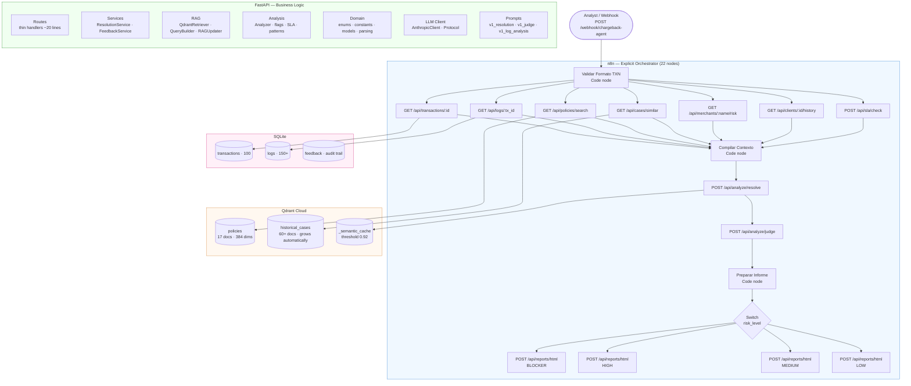

# Architecture — CIRI Chargeback Agent

## Table of Contents

1. [System Overview](#system-overview) — Architecture Pattern
2. [n8n Explicit Orchestration](#n8n-explicit-orchestration)
3. [Full Flowchart](#full-flowchart)
4. [Modularity](#modularity)
5. [Scalability](#scalability)
6. [Data Flow Description](#data-flow-description)
7. [Architectural Decision Records](#architectural-decision-records)

---

## System Overview

### Architecture Pattern

**Explicit Workflow Orchestration with LLM-augmented tools** — sometimes called an *Agentic Pipeline*.

This is not an AI Agent. In a classic AI Agent, the LLM decides which tools to call and in what order. Here, **n8n decides the flow explicitly** — 22 named nodes, always the same sequence, fully auditable. The LLM only reasons about the data it receives; it never controls the execution path.

| | AI Agent clásico | Este sistema |
|---|---|---|
| Quién decide el flujo | El LLM | n8n (explícito, 22 nodos) |
| Auditabilidad | Black box | Cada paso es un nodo visible |
| Determinismo | No garantizado | Siempre la misma secuencia |
| Debugging | Difícil | Nodo por nodo en el canvas |

The LLM's role is scoped and deliberate: it evaluates policy compliance, synthesizes a resolution with reasoning, and acts as a quality judge. It does not orchestrate.

---

The CIRI Chargeback Agent is a multi-service system where each layer has a **single, clearly bounded responsibility**:

| Layer | Technology | Responsibility |
|---|---|---|
| Orchestration | n8n (22 explicit nodes) | WHAT to do and WHEN — webhook, sequencing, routing by risk |
| Business logic | FastAPI | HOW — policy retrieval, resolution synthesis, guardrails, feedback |
| Semantic store | Qdrant Cloud | Unstructured truth — policies, historical cases, semantic cache |
| Structured store | SQLite | Relational truth — transactions, logs, feedback, audit trail |
| LLM | Claude Sonnet 4.6 | Policy evaluation, resolution synthesis, quality judge, log analysis |
| Observability | Langfuse | Token cost, latency, judge scores, cache hit rate |

**Core principle:** n8n knows WHAT and WHEN. FastAPI knows HOW. The LLM only lives inside FastAPI endpoints — n8n never calls the LLM directly.

---

## n8n Explicit Orchestration

The workflow contains **22 named nodes across 4 sections**. There is no AI Agent node, no black box, no tool calling decided by an LLM. Every step is a visible, named HTTP Request node with a specific endpoint and a specific purpose.

```
§1 — ENTRY (2 nodes)
   [Webhook — Entrada]
       ↓
   [Validar Formato TXN]  ← Code node: validates TXN-XXXXX format

§2 — CONTEXT ASSEMBLY (7 HTTP GET/POST calls)
   [Obtener Transacción]     GET  /api/transactions/{id}
   [Obtener Logs]            GET  /api/logs/{tx_id}
   [Buscar Políticas]        GET  /api/policies/search        ← RAG: Qdrant semantic
   [Buscar Casos Similares]  GET  /api/cases/similar          ← RAG: Qdrant semantic
   [Riesgo del Comercio]     GET  /api/merchants/{name}/risk
   [Historial del Cliente]   GET  /api/clients/{id}/history
   [Verificar SLA]           POST /api/sla/check

§3 — AI ANALYSIS (3 nodes)
   [Compilar Contexto]        ← Code node: merges all 7 results
       ↓
   [Sintetizar Resolución]    POST /api/analyze/resolve  ← LLM: synthesis + guardrails
       ↓
   [Juez de Calidad]          POST /api/analyze/judge    ← LLM-as-Judge: score 1–10

§4 — RISK ROUTING (Switch + 4 branches)
   [Preparar Informe]         ← Code node: builds ReportRequest payload
       ↓
   [Switch — Nivel de Riesgo]
      BLOCKER → [Generar Reporte] → [Responder HTML]
      HIGH    → [Generar Reporte] → [Responder HTML]
      MEDIUM  → [Generar Reporte] → [Responder HTML]
      LOW     → [Generar Reporte] → [Responder HTML]
```

**Why explicit instead of AI Agent?** An AI Agent node decides autonomously which tools to call and in what order. That creates a black box — no audit trail, non-deterministic sequencing, impossible to debug when it skips a step. The explicit workflow guarantees that every investigation always executes the same 7 context-gathering steps in the same order, every time.

---

## Full Flowchart



---

## Modularity

The system is structured in concentric layers. Each layer depends only on the layers below it. No layer has upward dependencies.

```
routes/          ← HTTP interface only. ~20 lines each. Zero business logic.
    ↓
services/        ← Orchestrates domain operations. No HTTP knowledge.
    ↓
analysis/ · rag/ · llm/   ← Pure domain logic. No FastAPI imports.
    ↓
data/            ← Pure data access. No business logic.
    ↓
domain/          ← Models, enums, constants. No external dependencies.
```

**Practical consequences of this structure:**

| Change needed | Files touched | Files untouched |
|---|---|---|
| Swap Anthropic → OpenAI | `llm/client.py` only | Everything else |
| Swap Qdrant → Pinecone | `rag/indexer.py` + `rag/retriever.py` | Everything else |
| Add new API endpoint | One file in `routes/` | All existing routes |
| Add new policy | `POST /api/policies/` (API call, no code) | Entire codebase |
| Update a prompt | One versioned file in `llm/prompts/` | Everything else |
| Change fraud score threshold | `domain/constants.py` line 1 | Everything else |

**n8n modularity:** Adding a new data source (e.g., a fraud score API) is one more HTTP Request node in §2. The rest of the workflow is untouched. Adding a new risk level is one more branch in the §4 Switch node.

**Protocol-based LLM client:** `llm/client.py` defines a `LLMClient` Protocol. `AnthropicClient` implements it. Tests use `MockLLMClient`. Swapping providers requires implementing the Protocol — no call sites change.

---

## Scalability

### Horizontal scaling (stateless API)

FastAPI is fully stateless. All state lives in Qdrant Cloud and SQLite. Multiple instances of the API can run behind a load balancer without coordination. Adding capacity is a one-line change in the deployment config.

### Knowledge base grows automatically

Every resolved case with `judge_score >= 8.0` is automatically indexed as a new precedent in Qdrant `historical_cases`. The RAG system improves over time without any manual intervention. A system that processed 1,000 chargebacks has 1,000+ precedents to draw from; a new installation has 60.

### Policies scale without code

The system supports any number of policies in any category. Adding a new regulatory requirement, a new payment method policy, or a new exception rule is a single API call. No code review, no deploy, no downtime. The LLM evaluates compliance from the natural language description.

### Semantic cache reduces LLM cost at scale

The `_semantic_cache` collection stores embeddings of recent resolutions. If an incoming request is semantically similar (cosine similarity ≥ 0.92) to a cached one, the LLM call is skipped entirely. In a production fintech processing thousands of similar cases daily, this dramatically reduces API cost.

### Versioned prompts enable safe iteration

All prompts are in versioned files (`v1_resolution.py`, `v1_judge.py`, etc.). Updating a prompt is a file change that can be A/B tested, rolled back, or deployed independently of the business logic. The version prefix makes it explicit which prompt version produced which resolution in the audit trail.

### Observable at every dimension

Langfuse traces every LLM call with: model, token count, latency, prompt version, judge score. This makes it possible to identify when a prompt version is underperforming, which merchants generate the most expensive cases, and what the p99 latency is per endpoint — without touching application code.

---

## Data Flow Description

### Phase 1: Entry

A chargeback investigation starts when a webhook fires. n8n's `[Validar Formato TXN]` Code node validates the `TXN-XXXXX` format before any downstream call is made, failing fast with a clear error message if the format is wrong.

### Phase 2: Context assembly (§2 — 7 parallel calls)

n8n fires 7 HTTP calls to gather all evidence:

1. `GET /api/transactions/{id}` — structured data from SQLite (amount, merchant, country, fraud_score, client_vip)
2. `GET /api/logs/{tx_id}` — all event logs for the transaction (INFO/WARN/ERROR severity)
3. `GET /api/policies/search` — semantic search over Qdrant `policies`; QueryBuilder enriches the query deterministically before embedding (see ADR-005)
4. `GET /api/cases/similar` — top-5 semantically similar historical cases from Qdrant
5. `GET /api/merchants/{name}/risk` — chargeback ratio, fraud flags, known problematic merchants
6. `GET /api/clients/{id}/history` — client's chargeback history, VIP status, previous resolutions
7. `POST /api/sla/check` — deadline calculation: 10 days LATAM / 15 days non-LATAM

### Phase 3: Resolution synthesis (§3)

`[Compilar Contexto]` merges all 7 results into a single structured object. `POST /api/analyze/resolve` then executes internally:

1. Checks `_semantic_cache` — if hit (similarity ≥ 0.92), returns cached resolution immediately
2. Formats policies for LLM context via `rag/formatter.py`
3. Calls `v1_resolution` prompt → Resolution JSON with verdict, risk_level, reasoning, blockers
4. Applies post-LLM guardrails: APPROVE + BLOCKER active → force REJECT (hallucination guard)
5. Returns Resolution with any guardrail warnings appended

`POST /api/analyze/judge` evaluates the resolution across 5 criteria (factual accuracy, policy compliance, reasoning quality, risk classification, recommendation clarity). Returns `overall_score` 1.0–10.0.

### Phase 4: Risk routing (§4)

`[Preparar Informe]` builds the `ReportRequest` payload. The Switch node routes by `resolution.risk_level`:

- **BLOCKER** — auto-reject. Crypto payment or fraud score ≤ 30 with active blocker policy. Report generated immediately.
- **HIGH** — elevated risk. VIP client or high-value transaction. Report includes HITL form for analyst review.
- **MEDIUM** — standard risk. Report with full reasoning and recommended action.
- **LOW** — low risk. Expedited report with auto-approval recommendation.

All four branches call the same `POST /api/reports/html` endpoint with the same `ReportRequest` shape. The HTML template renders conditionally based on `risk_level` and `verdict`.

### Phase 5: Auto-improvement

When an analyst submits feedback via `POST /api/feedback`, `FeedbackService` saves it to SQLite. If `judge_score >= 8.0`, `RAGUpdater.on_case_resolved()` indexes the resolved case as a new precedent in Qdrant `historical_cases`. Future similar cases will retrieve this case as a high-quality example, continuously improving resolution quality.

---

## Architectural Decision Records

### ADR-001: n8n as Explicit Orchestrator (not AI Agent)

**Status:** Accepted

**Context:** The system needs an orchestration layer that provides a visual, auditable flow for non-technical stakeholders and guarantees deterministic execution order for every chargeback investigation.

**Decision:** Use n8n with 22 explicit HTTP Request nodes — no AI Agent node, no LLM-based tool calling in n8n. Every step is a named node. The LLM is called only from FastAPI endpoints (`/api/analyze/resolve` and `/api/analyze/judge`).

**Consequences:**
- Every investigation executes the exact same 7 context-gathering steps in the same order, every time
- The workflow is a complete visual audit trail — any stakeholder can open n8n and see exactly what happened
- Adding a new data source = one HTTP Request node in §2, no code change
- The workflow JSON is version-controlled and importable in any n8n instance

**Alternatives rejected:** n8n AI Agent — non-deterministic tool call ordering, no audit trail, impossible to guarantee all 7 context sources are always consulted; LangGraph — adds Python dependency overhead, hides the visual flow.

---

### ADR-002: FastAPI for All Business Logic

**Status:** Accepted

**Context:** Business logic needs to be independently testable, versioned, and callable by multiple orchestrators (n8n today, potentially others tomorrow).

**Decision:** All domain logic lives in FastAPI behind clean HTTP endpoints. n8n communicates via REST only.

**Consequences:**
- Every piece of logic is testable with `pytest` independently of n8n
- 50 tests pass without any n8n or Qdrant running (mocked in `tests/conftest.py`)
- n8n is replaceable (Temporal, Airflow, a cron job) without touching FastAPI
- OpenAPI docs at `/docs` are auto-generated and always current

**Alternatives rejected:** Embedding logic in n8n Code nodes — not testable, not reusable, not independently versioned.

---

### ADR-003: Qdrant + SQLite Hybrid Storage

**Status:** Accepted

**Context:** Two fundamentally different data retrieval needs: semantic similarity (find policies/cases similar in meaning) and exact structured queries (get transaction by ID, filter logs by severity).

**Decision:** Qdrant for semantic data; SQLite for structured data. SQLite is write-primary; Qdrant is derived from it via `RAGUpdater`.

**Consequences:**
- Every policy CRUD operation triggers immediate Qdrant re-indexing — no stale embeddings
- SQLite provides a full audit trail with timestamps for every policy change
- No PostgreSQL dependency — SQLite runs in-process, zero configuration

**Alternatives rejected:** PostgreSQL with pgvector — operational overhead not justified; pure Qdrant — no structured query capability, no foreign keys, no audit trail.

---

### ADR-004: Policies as Data, Not Code

**Status:** Accepted

**Context:** Chargeback policies change frequently due to regulatory updates, network rule changes (Visa/Mastercard), and internal risk calibrations.

**Decision:** 17 policies stored as Markdown in Qdrant + rows in SQLite. REST API enables management. Every write re-indexes immediately.

**Example — adding a new fraud policy:**
```bash
POST /api/policies/
{"code": "POL-FRD-005", "category": "FRAUDE", "name": "Nuevo método de pago", "description": "..."}
```
Available to the next resolution request. No code change. No deploy. No downtime.

**Alternatives rejected:** Hard-coded Python classes — every policy change requires code review, PR, and deployment.

---

### ADR-005: Deterministic QueryBuilder for RAG

**Status:** Accepted

**Context:** Building Qdrant search queries requires domain enrichment. This could be done by an LLM (flexible, costly, non-deterministic) or by rule-based logic (reproducible, free, fast).

**Decision:** `QueryBuilder` in `rag/retriever.py` builds all queries without an LLM call:

| Condition | Enrichment |
|---|---|
| `payment_method == "Cripto"` | `"criptomonedas no reversible blocker"` |
| `fraud_score < 30` | `"transaccion de alto riesgo fraude score bajo"` |
| `country not in LATAM_COUNTRIES` | `"internacional fuera LATAM plazo extendido"` |
| `channel == "IVR"` | `"limite monto IVR"` |

**Consequences:**
- Same transaction always generates the same query — reproducible and debuggable
- Zero token cost at retrieval time
- For policies: `top_k=17, threshold=0.0` — retrieve all, let the LLM determine relevance
- For cases: `top_k=5, threshold=0.40` — only semantically meaningful precedents

**Alternatives rejected:** LLM-generated queries — adds latency and cost to every request, non-deterministic, harder to debug.
