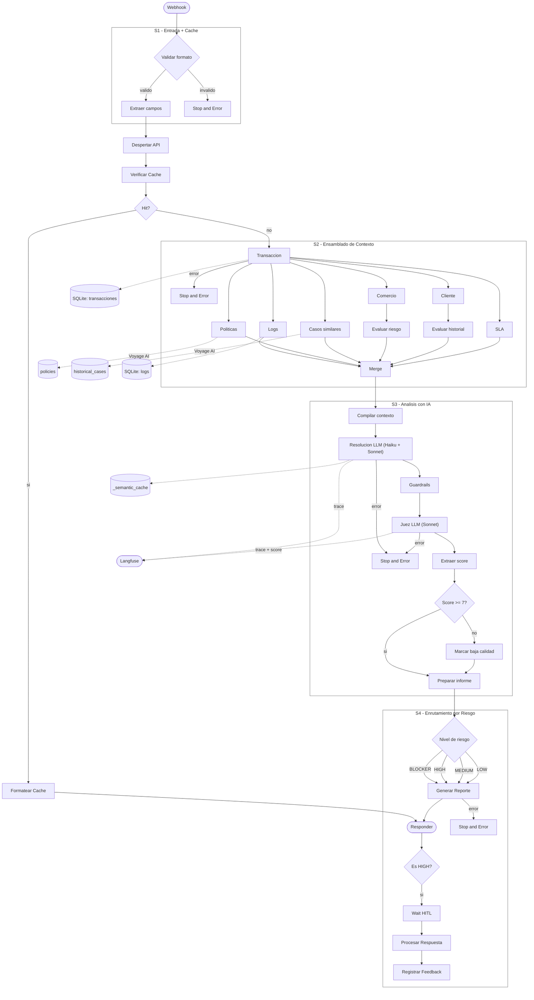

# Arquitectura — Agente de Contracargos CIRI

## Tabla de Contenidos

1. [Vision General](#vision-general) -- Patron de arquitectura
2. [Orquestacion Explicita con n8n](#orquestacion-explicita-con-n8n)
3. [Diagrama Completo](#diagrama-completo)
4. [El Principio Central: El Codigo Decide, el LLM Explica](#el-principio-central-el-codigo-decide-el-llm-explica)
5. [Modularidad](#modularidad)
6. [Escalabilidad](#escalabilidad)
7. [Flujo de Datos](#flujo-de-datos)
8. [Decisiones de Arquitectura (ADR)](#decisiones-de-arquitectura-adr)
9. [Consideraciones de Seguridad](#consideraciones-de-seguridad)

---

## Vision General

### Patron de Arquitectura

**Orquestacion explicita con herramientas aumentadas por LLM** -- a veces llamado *Pipeline Agentico*.

Esto no es un Agente de IA clasico. En un agente clasico, el LLM decide que herramientas llamar y en que orden. Aca, **n8n decide el flujo de forma explicita** -- 54 nodos (43 ejecutables + 11 sticky notes), siempre la misma secuencia, completamente auditable. El LLM solo razona sobre los datos que recibe; nunca controla el camino de ejecucion.

| | Agente IA clasico | Este sistema |
|---|---|---|
| Quien decide el flujo | El LLM | n8n (explicito, 54 nodos) |
| Auditabilidad | Caja negra | Cada paso es un nodo visible |
| Determinismo | No garantizado | Siempre la misma secuencia |
| Debugging | Dificil | Nodo por nodo en el canvas |

El LLM tiene un rol acotado y deliberado: evalua cumplimiento de politicas (Haiku), sintetiza una resolucion con razonamiento (Sonnet) y actua como juez de calidad (Sonnet). Nunca orquesta.

---

El sistema se compone de capas con **una responsabilidad unica y claramente delimitada**:

| Capa | Tecnologia | Responsabilidad |
|---|---|---|
| Orquestacion | n8n Cloud (54 nodos: 43 exec + 11 sticky) | QUE hacer y CUANDO -- webhook, secuenciamiento, logica nativa, visibilidad de guardrails, enrutamiento por riesgo |
| Logica de negocio | FastAPI (Render free tier) | COMO -- RAG retrieval, sintesis de resolucion con guardrails, feedback, auto-indexing |
| Almacen semantico | Qdrant Cloud (free tier) | Verdad no estructurada -- politicas, casos historicos, cache semantico |
| Almacen estructurado | SQLite | Verdad relacional -- transacciones, logs, feedback, audit trail |
| LLM (eval. politicas) | Claude Haiku 4.5 via FastAPI | Evaluacion de cumplimiento de politicas (rapido, economico) |
| LLM (sintesis + juez) | Claude Sonnet via FastAPI | Sintesis de resolucion + Judge de calidad 1-10 (razonamiento fuerte) |
| Embeddings | Voyage AI (free tier) | `voyage-multilingual-2` (1024 dims, multilingual) |
| Observabilidad | Langfuse | Tokens, latencia, scores del juez, tasa de cache hits |

**Principio central:** n8n sabe QUE y CUANDO; usa nodos nativos (Set, IF, Switch, Merge) para logica deterministica. FastAPI maneja RAG, sintesis LLM con guardrails, feedback y la evaluacion del Juez. Todas las llamadas LLM pasan por FastAPI para observabilidad consistente y versionado de prompts.

### Stack y restricciones de infraestructura

El sistema esta disenado para funcionar dentro de los limites de servicios gratuitos:

- **n8n Cloud** (trial): orquestacion visual, webhook publico, HITL con Wait nodes
- **Render** (free tier): la API se duerme tras 15 minutos de inactividad. El workflow incluye un nodo `[Despertar API]` que hace `GET /health` antes de cualquier llamada para manejar el cold start
- **Qdrant Cloud** (free tier): 1GB de almacenamiento, suficiente para las 3 colecciones del sistema
- **Voyage AI** (free tier): embeddings multilingues. El sistema usa batch embedding (1 API call para policies + cases) para minimizar consumo

Estas restricciones no son ideales, pero el sistema las maneja de forma transparente. En produccion se reemplazarian por instancias dedicadas sin cambiar una linea de codigo.

---

## Orquestacion Explicita con n8n

El workflow contiene **54 nodos (43 ejecutables + 11 sticky notes) organizados en 4 secciones**. No hay nodo AI Agent, no hay caja negra, no hay tool calling decidido por un LLM. Cada paso es un nodo visible con un proposito especifico -- nodos nativos de n8n para logica deterministica, nodos HTTP Request para llamadas externas.

```
S1 -- ENTRADA + CACHE (6 nodos)
   [Webhook -- Entrada]              <- HTTP POST trigger (API/curl)
   [Validar Formato -- IF]           <- IF node: valida formato TXN-XXXXX
   [Validar Formato TXN]            <- Set node: normaliza campos
   [Despertar API]                  <- HTTP GET /health (despierta cold-start de Render)
   [Verificar Cache]                <- HTTP GET /api/cache/lookup
   [Cache Hit?]                     <- IF node: si hay cache -> responder inmediatamente

S2 -- ENSAMBLADO DE CONTEXTO (11 nodos)
   [Obtener Transaccion]         GET  /api/transactions/{id}
   [Obtener Logs]                GET  /api/logs/{tx_id}
   [Buscar Politicas]            GET  /api/policies/search     <- RAG: Qdrant semantico
   [Buscar Casos Similares]      GET  /api/cases/similar       <- RAG: Qdrant semantico
   [Riesgo del Comercio]         GET  /api/merchants/{name}/risk
   [Evaluar Riesgo Comercio]     <- Set node: is_suspended, is_high_risk, is_strategic
   [Historial del Cliente]       GET  /api/clients/{id}/history
   [Evaluar Historial Cliente]   <- Set node: is_recidivist, has_geo_anomaly, is_vip
   [Verificar SLA]               <- Set node: calculo de fechas -> within_sla, sla_limit_days
   [Merge -- Contexto Paralelo]  <- Merge node: espera las 6 ramas paralelas

S3 -- ANALISIS CON IA (8 nodos)
   [Compilar Contexto]            <- Code node: fusiona todos los outputs de ramas
   [Sintetizar Resolucion]        POST /api/analyze/resolve  <- LLM + RAG + guardrails
   [Verificar Guardrails]         <- Code node: visibilidad de guardrails en canvas
   [Juez de Calidad]              POST /api/analyze/judge    <- LLM-as-Judge
   [Extraer Evaluacion -- Juez]   <- Set node: JSON.parse -> judge_evaluation
   [Juez Aprueba? (>=7.0)]        <- IF node: score >= 7.0 pasa / < 7.0 falla
   [Marcar -- Calidad Baja]       <- Set node: agrega flag LOW_QUALITY
   [Preparar Informe]             <- Code node: construye payload ReportRequest

S4 -- ENRUTAMIENTO POR RIESGO + RESPUESTA (7 nodos)
   [Switch -- Nivel de Riesgo]
      TODOS los niveles -> [Generar Reporte] POST /api/reports/html -> [Responder -- Reporte]
      -> [Es HIGH?]              <- IF node: verifica risk_level == HIGH
         true  -> [Wait -- Aprobacion HITL]   <- Wait node: formulario (5s auto-approve)
               -> [Procesar Respuesta HITL]   <- Code: fusiona decision del analista
               -> [Registrar Feedback HITL]   <- POST /api/feedback (auto-index si score >= 8.0)
         false -> (fin)
   Todos los errores -> [Stop and Error] -> Error Handler workflow
```

**HITL (Human-in-the-Loop):** Todos los niveles de riesgo primero responden al webhook con el reporte HTML. Despues de responder, un nodo IF verifica si `risk_level == HIGH`. Si es verdadero, un **Wait node** pausa la ejecucion y expone un formulario (APROBAR/RECHAZAR + notas del analista). Despues de que el analista envia (o timeout de 5s auto-aprueba), el feedback se registra via `POST /api/feedback`. La clave: `respondToWebhook` se ejecuta **antes** del Wait, evitando el error de n8n "unused respondToWebhook" en el resume. Los reportes HIGH tambien incluyen un formulario HITL interactivo como fallback.

**Camino de respuesta unificado:** Los cuatro niveles de riesgo convergen en `[Generar Reporte]` -> `[Responder -- Reporte]`. Los cache hits pasan por `[Formatear Cache]` antes del mismo responder. Los errores usan nodos `stopAndError` que propagan al Error Handler workflow.

**Por que explicito en vez de AI Agent?** Un nodo AI Agent decide autonomamente que herramientas llamar y en que orden. Eso crea una caja negra -- sin audit trail, secuenciamiento no determinista, imposible de debuggear cuando se salta un paso. El workflow explicito garantiza que cada investigacion siempre ejecuta los mismos 7 pasos de recopilacion de contexto en el mismo orden, todas las veces.

---

## Diagrama Completo



---

## El Principio Central: El Codigo Decide, el LLM Explica

Esta es la decision de diseno mas importante del sistema, y vale la pena explicarla bien.

En un agente de IA tipico, el LLM decide todo: la accion recomendada, el nivel de riesgo, si necesita revision humana, la razon. El problema es que un LLM puede alucinar, contradecirse, o ignorar una politica que acaba de evaluar como FAIL. En un sistema de compliance financiero, eso es inaceptable.

Nuestro enfoque: **el codigo Python determina 6 de los 11 campos de la resolucion de forma deterministica**. El LLM solo genera los campos narrativos (razonamiento, resumen, confianza, compensacion sugerida, observaciones).

### Campos deterministas (Python los calcula, el LLM no puede cambiarlos)

| Campo | Logica |
|---|---|
| `recommended_action` | BLOCKER -> REJECT. Cualquier FAIL -> PENDING_HITL. Todo PASS -> APPROVE |
| `risk_level` | BLOCKER activo -> BLOCKER. >= 2 FAILs o fraud_score < 15 -> HIGH. 1 FAIL -> MEDIUM. Sin FAILs -> LOW |
| `requires_hitl` | `true` si hay algun FAIL o `requires_human_review` en verdicts |
| `hitl_reason` | Texto generado desde conteo de violaciones y codigos de politica |
| `policy_verdicts` | Lista de evaluaciones (el LLM las genera, pero pasan por sanitizacion) |
| `precedent_summary` | Resumen de precedentes construido por `_build_precedent_summary()` |

### Campos narrativos (el LLM los genera)

| Campo | Proposito |
|---|---|
| `reasoning` | Explicacion paso a paso de por que se llega a la conclusion |
| `summary` | Resumen ejecutivo del caso |
| `confidence` | Nivel de confianza del LLM en su analisis (0-1) |
| `compensation_amount_usd` | Monto sugerido de compensacion |
| `observations` | Notas adicionales del analisis |

El LLM recibe como parte del prompt el `determined_outcome` (la decision que Python ya tomo), y su trabajo es **explicar y justificar** esa decision, no inventar otra. Si intenta devolver algo distinto, el override post-LLM lo corrige silenciosamente.

### Whitelist de BLOCKER: solo POL-EXC-003

No todas las politicas deberian poder producir un veredicto BLOCKER. En la practica, descubri que el LLM a veces sobre-escala -- por ejemplo, marca una suspension de comerciante como BLOCKER cuando deberia ser FAIL. Eso producia rechazos automaticos injustificados.

La solucion fue una whitelist (`BLOCKER_POLICY_CODES`): solo `POL-EXC-003` (criptomonedas -- pago irreversible, no se puede proceder) puede producir BLOCKERs legitimos. Cualquier otro veredicto BLOCKER se degrada automaticamente a FAIL con `requires_human_review = true`:

```python
BLOCKER_POLICY_CODES: frozenset[str] = frozenset({"POL-EXC-003"})

for v in verdicts:
    if v["verdict"] == "BLOCKER" and v["policy_code"] not in BLOCKER_POLICY_CODES:
        v["verdict"] = "FAIL"
        v["requires_human_review"] = True
```

Esto no es paranoia -- fue un bug real que detectamos durante testing. El LLM evaluaba correctamente que un comerciante estaba suspendido, pero escalaba a BLOCKER en vez de FAIL, lo que disparaba un rechazo automatico sin revision humana.

---

## Modelo Dual: Haiku para Eval, Sonnet para Sintesis

El pipeline de resolucion hace 3 llamadas LLM. No todas necesitan el mismo nivel de razonamiento:

| Llamada | Modelo | Razon |
|---|---|---|
| Evaluacion de politicas | Haiku 4.5 | Tarea estructurada (lista de verdicts JSON). Haiku es rapido y suficiente |
| Sintesis de resolucion | Sonnet | Razonamiento complejo: integrar politicas + precedentes + logs + merchant risk |
| Juez de calidad | Sonnet | Evaluar calidad de otro LLM requiere razonamiento de nivel superior |

La configuracion es via variables de entorno:
- `CB_LLM_MODEL=claude-haiku-4-5-20251001` -- modelo por defecto (eval de politicas)
- `CB_LLM_MODEL_RESOLUTION=claude-sonnet-4-20250514` -- modelo para sintesis y juez

Si `CB_LLM_MODEL_RESOLUTION` esta vacio, se usa el modelo por defecto para todo. Esto permite que los tests corran con un solo mock.

Con esta configuracion, el score promedio del Juez es **9.1/10** sobre los escenarios de demo, y los 244 tests pasan.

---

## Sistema de Etiquetado de Precedentes

Cuando el sistema recupera casos historicos similares de Qdrant, no los presenta al LLM como una lista plana. Cada caso pasa por un proceso de etiquetado determinista (sin LLM):

### Etiquetas

- **[MOTIVO SIMILAR]**: el motivo del caso historico comparte un grupo de sinonimos con el motivo actual. Los grupos de sinonimos son manuales y cubren patrones comunes: "cargo duplicado", "fraude / no reconocido", "producto no recibido", etc.
- **[MISMO MERCHANT]**: el comerciante del caso historico coincide exactamente con el comerciante de la transaccion actual.

### Mecanismo

```python
# Grupos de sinonimos para matching mecanico
_MOTIVO_SYNONYM_GROUPS = [
    ("cargo duplicado", {"duplicado", "duplicada", "doble", "doble cobro"}),
    ("fraude / no reconocido", {"no reconoce", "no autorizado", "fraude"}),
    ("producto no recibido", {"no recibido", "no entregado", "no llego"}),
    ...
]
```

Los casos con etiquetas se ordenan primero en el prompt. Ademas, el `precedent_summary` (campo determinista de la resolucion) incluye un analisis de patron:

```
CB-042 [MOTIVO SIMILAR] [MISMO MERCHANT]: fraude, Aprobado en 3d, merchant=Crypto.com.
Patron: de 5 precedentes, 3 aprobados, 1 rechazado -- tendencia favorable al cliente.
Motivo similar: 2/5, 2 aprobados.
```

Esto le da al LLM contexto estructurado para que su razonamiento sea trazable. No es el LLM el que decide si un precedente es relevante -- ya viene etiquetado.

---

## Modularidad

El sistema esta organizado en capas concentricas. Cada capa depende solo de las capas inferiores. Ninguna tiene dependencias hacia arriba.

```
routes/          <- Interfaz HTTP. ~20 lineas cada uno. Cero logica de negocio.
    |
services/        <- Orquesta operaciones de dominio. Sin conocimiento HTTP.
    |
analysis/ . rag/ . llm/   <- Logica de dominio pura. Sin imports de FastAPI.
    |
data/            <- Acceso a datos puro. Sin logica de negocio.
    |
domain/          <- Modelos, enums, constantes. Sin dependencias externas.
```

**Consecuencias practicas de esta estructura:**

| Cambio necesario | Archivos tocados | Archivos intactos |
|---|---|---|
| Cambiar Anthropic por OpenAI | `llm/client.py` unicamente | Todo lo demas |
| Cambiar Qdrant por Pinecone | `rag/indexer.py` + `rag/retriever.py` | Todo lo demas |
| Agregar nuevo endpoint | Un archivo en `routes/` | Todas las rutas existentes |
| Agregar nueva politica | `POST /api/policies/` (llamada API, sin codigo) | Todo el codebase |
| Actualizar un prompt | Un archivo versionado en `llm/prompts/` | Todo lo demas |
| Cambiar umbral de fraud score | Una linea en `domain/constants.py` | Todo lo demas |

**Modularidad en n8n:** Agregar una nueva fuente de datos (por ejemplo, un API de fraud scoring externo) es un nodo HTTP Request mas en S2. El resto del workflow queda intacto. Agregar un nuevo nivel de riesgo es una rama mas en el Switch de S4.

**Cliente LLM basado en Protocol:** `llm/client.py` define un `Protocol` llamado `LLMClient`. `AnthropicClient` lo implementa. Los tests usan `MockLLMClient`. Cambiar de proveedor requiere implementar el Protocol -- ninguno de los call sites cambia.

---

## Escalabilidad

### Escalado horizontal (API stateless)

FastAPI es completamente stateless. Todo el estado vive en Qdrant Cloud y SQLite. Multiples instancias de la API pueden correr detras de un load balancer sin coordinacion. Agregar capacidad es un cambio de una linea en la config de deploy.

### La base de conocimiento crece sola

Cada caso resuelto con `judge_score >= 8.0` se indexa automaticamente como nuevo precedente en la coleccion `historical_cases` de Qdrant. El sistema RAG mejora con el tiempo sin intervencion manual. Un sistema que proceso 1,000 contracargos tiene 1,000+ precedentes para consultar; una instalacion nueva arranca con 60.

### Las politicas escalan sin codigo

El sistema soporta cualquier cantidad de politicas en cualquier categoria. Agregar un nuevo requisito regulatorio, una politica de metodo de pago, o una regla de excepcion es una sola llamada API. Sin code review, sin deploy, sin downtime. El LLM evalua cumplimiento desde la descripcion en lenguaje natural.

```bash
POST /api/policies/
{"code": "POL-FRD-005", "category": "FRAUDE", "name": "Nuevo metodo", "description": "..."}
```

Disponible para la proxima resolucion. Sin cambio de codigo.

### Cache semantico reduce costo LLM a escala

La coleccion `_semantic_cache` almacena embeddings de resoluciones recientes. Si una solicitud entrante es semanticamente similar (coseno >= 0.92) a una cacheada, la llamada LLM se omite por completo. En una fintech procesando miles de casos similares por dia, esto reduce dramaticamente el costo de API.

En nuestras pruebas, el segundo run de un caso identico baja de ~113 segundos a ~2 segundos.

### Prompts versionados para iteracion segura

Todos los prompts estan en archivos versionados (`v1_policy_eval.py`, `v1_resolution.py`, `v1_judge.py`). Actualizar un prompt es un cambio de archivo que puede testearse por A/B, revertirse o deployarse independientemente de la logica de negocio. El prefijo de version hace explicito que version de prompt produjo que resolucion en el audit trail.

### Observabilidad en cada dimension

Langfuse traza cada llamada LLM con: modelo, conteo de tokens, latencia, version de prompt, score del juez. Esto permite identificar cuando una version de prompt esta rindiendo mal, que comerciantes generan los casos mas costosos, y cual es la latencia p99 por endpoint -- sin tocar codigo de aplicacion.

---

## Flujo de Datos

### Fase 1: Entrada y verificacion de cache

Una investigacion de contracargo arranca desde un **Webhook** -- `POST /webhook/chargeback-agent` con body JSON (`transaction_id`, `motivo`, `cliente_vip`).

`[Validar Formato -- IF]` valida el formato `TXN-XXXXX`. Requests invalidos van directo a un nodo `stopAndError`. Los validos pasan por `[Despertar API]` (despierta la API en Render si esta dormida), y luego `[Verificar Cache]` consulta el cache de idempotencia. Si hay hit, `[Formatear Cache]` envia el HTML almacenado directamente a `[Responder -- Reporte]`, saltando el pipeline completo.

### Fase 2: Ensamblado de contexto (S2 -- 6 llamadas HTTP + nodos nativos)

n8n dispara 6 llamadas HTTP y usa 3 nodos Set nativos para recopilar toda la evidencia:

1. `GET /api/transactions/{id}` -- datos estructurados de SQLite (monto, comerciante, pais, fraud_score, client_vip)
2. `GET /api/logs/{tx_id}` -- todos los logs de eventos de la transaccion (severidad INFO/WARN/ERROR)
3. `GET /api/policies/search` -- busqueda semantica sobre la coleccion `policies` de Qdrant; el QueryBuilder enriquece la consulta deterministicamente antes de embeddear (ver ADR-005)
4. `GET /api/cases/similar` -- top-5 casos historicos semanticamente similares de Qdrant, con etiquetado [MOTIVO SIMILAR] y [MISMO MERCHANT]
5. `GET /api/merchants/{name}/risk` -- perfil de riesgo del comerciante calculado por `Analyzer.merchant_risk_profile()`: cb_ratio, total_transactions, flags (suspended/high_cb_ratio), is_strategic; **evaluacion adicional en n8n** via el nodo Set `[Evaluar Riesgo Comercio]`
6. `GET /api/clients/{id}/history` -- flags del cliente calculados por `Analyzer.client_flags()`: total_transactions, total_chargebacks, flags (recidivist, geo_anomaly), paises/metodos usados; **evaluacion adicional en n8n** via el nodo Set `[Evaluar Historial Cliente]`
7. `[Verificar SLA]` -- **nodo Set nativo de n8n** usando expresiones de calculo de fechas: `Math.floor((Date.now() - new Date(tx.date)) / 86400000)`, verificacion LATAM inline, `sla_limit_days` (5 VIP / 10 LATAM / 15 fuera de LATAM)

Las 6 ramas paralelas convergen en `[Merge -- Contexto Paralelo]` (nodo Merge, indices 0-5 conectados explicitamente).

### Fase 3: Sintesis de resolucion (S3)

`[Compilar Contexto]` fusiona todos los outputs de las ramas -- incluyendo tanto datos crudos HTTP como flags evaluados por n8n -- en un solo objeto estructurado. `POST /api/analyze/resolve` ejecuta internamente:

1. Verifica `_semantic_cache` -- si hay hit (similitud >= 0.92), devuelve resolucion cacheada inmediatamente
2. **Evaluacion de politicas** (Haiku): evalua cada politica contra la transaccion, genera lista de verdicts
3. **Sanitizacion de verdicts**: la whitelist de BLOCKER degrada verdicts invalidos
4. **Outcome determinista**: Python calcula action, risk_level, requires_hitl desde los verdicts
5. **Precedent summary**: etiquetado [MOTIVO SIMILAR] + [MISMO MERCHANT] + analisis de patron
6. **Sintesis** (Sonnet): genera razonamiento, resumen, confianza. Recibe el outcome determinista como dato, no como sugerencia
7. **Override post-LLM**: los 6 campos deterministas sobreescriben cualquier cosa que el LLM haya devuelto
8. **Guardrails post-LLM**: APPROVE + BLOCKER activo -> forzar REJECT (guardia anti-alucinacion)

**`[Verificar Guardrails]`** -- un nodo Code nativo que ejecuta chequeos de defensa en profundidad directamente en el canvas de n8n, haciendo visible el estado de guardrails sin necesidad de abrir los logs de FastAPI:
- APPROVE con BLOCKER -> flaggeado
- Compensacion > 110% del monto original -> flaggeado
- Confianza > 0.95 con >= 2 fallas de politica -> flaggeado

Estos son los mismos chequeos que FastAPI aplica -- n8n provee visibilidad en canvas, FastAPI provee enforcement.

`[Juez de Calidad]` llama a `POST /api/analyze/judge` via FastAPI usando Sonnet. El prompt `v1_judge` esta versionado en `llm/prompts/v1_judge.py` y se ejecuta a traves del mismo `AnthropicClient`, asegurando observabilidad consistente via Langfuse. El nodo `[Extraer Evaluacion -- Juez]` parsea la respuesta JSON. Devuelve `overall_score` de 1.0 a 10.0 evaluando 5 criterios: precision factual, cumplimiento de politicas, calidad del razonamiento, clasificacion de riesgo, claridad de la recomendacion.

**`[Juez Aprueba? (>=7.0)]`** -- un nodo IF nativo que filtra por el score del juez. Scores >= 7.0 pasan directo a `[Preparar Informe]`. Scores < 7.0 pasan por `[Marcar -- Calidad Baja]`, un nodo Set que agrega un flag `LOW_QUALITY` visible en el reporte final.

### Fase 4: Enrutamiento por riesgo (S4)

`[Preparar Informe]` construye el payload `ReportRequest`. El nodo Switch enruta por `resolution.risk_level`:

- **BLOCKER** -- rechazo automatico. Pago cripto o fraud score critico con politica blocker activa. Reporte generado inmediatamente.
- **HIGH** -- riesgo elevado. Cliente VIP o transaccion de alto valor. Despues de responder, n8n pausa en un **Wait node** con formulario HITL (APROBAR/RECHAZAR). Auto-aprueba tras 5s de timeout. Feedback registrado via `POST /api/feedback`.
- **MEDIUM** -- riesgo estandar. Reporte con razonamiento completo y accion recomendada.
- **LOW** -- riesgo bajo. Reporte expedito con recomendacion de auto-aprobacion.

Los cuatro niveles convergen en `[Generar Reporte]` -> `[Responder -- Reporte]` (el webhook responde inmediatamente con el reporte HTML). Despues de responder, un nodo IF verifica `risk_level == HIGH`; si es verdadero, la ejecucion continua a Wait -> Procesar -> Feedback. El `respondToWebhook` se dispara **antes** del Wait node, evitando el error de validacion de n8n "unused respondToWebhook" en el resume. Errores en generacion de reportes van a `[Stop and Error]` y propagan al Error Handler workflow.

### Fase 5: Mejora automatica

Cuando un analista envia feedback via `POST /api/feedback`, `FeedbackService` lo guarda en SQLite. Si `judge_score >= 8.0`, `RAGUpdater.on_case_resolved()` indexa el caso resuelto como nuevo precedente en la coleccion `historical_cases` de Qdrant. Casos similares futuros recuperaran este caso como ejemplo de alta calidad, mejorando continuamente la calidad de las resoluciones.

---

## Decisiones de Arquitectura (ADR)

### ADR-001: n8n como Orquestador Explicito (no AI Agent)

**Estado:** Aceptada

**Contexto:** Necesitabamos una capa de orquestacion que ofreciera un flujo visual y auditable para stakeholders no tecnicos, y que garantizara un orden de ejecucion determinista para cada investigacion de contracargo.

**Decision:** Usar n8n con 54 nodos (43 ejecutables + 11 sticky notes) -- sin nodo AI Agent, sin tool calling decidido por LLM. Cada paso es un nodo visible. Nodos nativos de n8n (Set, IF, Switch, Merge) manejan toda la logica deterministica. Los nodos HTTP Request se reservan para llamadas externas. Tanto el LLM de sintesis (`/api/analyze/resolve`) como el Juez (`/api/analyze/judge`) se llaman via FastAPI -- todas las interacciones con LLMs centralizadas con versionado de prompts, manejo de errores y observabilidad Langfuse consistente. Un nodo `Responder -- Reporte` unificado sirve todos los caminos de respuesta. Errores propagan a un Error Handler workflow separado via nodos `stopAndError`.

**Consecuencias:**
- Cada investigacion ejecuta exactamente los mismos pasos en el mismo orden, siempre
- El workflow es un audit trail visual completo -- cualquier stakeholder puede abrir n8n y ver que paso
- Nodos nativos manejan SLA, flags de comerciante, flags de cliente y parsing de respuesta del juez -- cero llamadas a FastAPI para logica deterministica
- Agregar nueva fuente de datos = un nodo HTTP Request + un nodo Set en S2, sin cambio de codigo
- El JSON del workflow esta versionado y es importable en cualquier instancia de n8n

**Alternativas descartadas:** n8n AI Agent -- orden de tool calls no determinista, sin audit trail, imposible garantizar que siempre se consulten las 7 fuentes de contexto; LangGraph -- agrega overhead de dependencia Python, esconde el flujo visual.

---

### ADR-002: FastAPI para Toda la Logica de Negocio

**Estado:** Aceptada

**Contexto:** La logica de negocio necesita ser testeable de forma independiente, versionada y callable por multiples orquestadores (n8n hoy, potencialmente otros manana).

**Decision:** Toda la logica de dominio vive en FastAPI detras de endpoints HTTP limpios. n8n se comunica unicamente via REST.

**Consecuencias:**
- Cada pieza de logica se testea con `pytest` independientemente de n8n
- 244 tests pasan sin que n8n ni Qdrant esten corriendo (mockeados en `tests/conftest.py`)
- n8n es reemplazable (Temporal, Airflow, un cron job) sin tocar FastAPI
- La documentacion OpenAPI en `/docs` se autogenera y siempre esta actualizada

**Alternativas descartadas:** Meter logica en nodos Code de n8n -- no testeable, no reutilizable, no versionable independientemente.

---

### ADR-003: Almacenamiento Hibrido Qdrant + SQLite

**Estado:** Aceptada

**Contexto:** Dos necesidades de recuperacion de datos fundamentalmente distintas: similitud semantica (encontrar politicas/casos similares en significado) y consultas estructuradas exactas (obtener transaccion por ID, filtrar logs por severidad).

**Decision:** Qdrant para datos semanticos; SQLite para datos estructurados. SQLite es la fuente primaria de escritura; Qdrant se deriva de ella via `RAGUpdater`.

**Consecuencias:**
- Cada operacion CRUD de politicas dispara re-indexacion inmediata en Qdrant -- sin embeddings desactualizados
- SQLite provee un audit trail completo con timestamps para cada cambio de politica
- Sin dependencia de PostgreSQL -- SQLite corre in-process, cero configuracion

La realidad es que SQLite tiene limitaciones (no soporta concurrencia de escritura, por ejemplo), pero para un sistema de esta escala funciona perfectamente. Si manana necesitaramos miles de resoluciones concurrentes, migrar a PostgreSQL seria un cambio solo en `data/db.py`.

**Alternativas descartadas:** PostgreSQL con pgvector -- overhead operacional no justificado para esta escala; Qdrant puro -- sin capacidad de consulta estructurada, sin foreign keys, sin audit trail.

---

### ADR-004: Politicas como Datos, no como Codigo

**Estado:** Aceptada

**Contexto:** Las politicas de contracargos cambian frecuentemente por actualizaciones regulatorias, cambios en reglas de red (Visa/Mastercard) y recalibraciones internas de riesgo.

**Decision:** 17 politicas almacenadas como Markdown en Qdrant + filas en SQLite. La API REST permite gestion. Cada escritura re-indexa inmediatamente.

**Ejemplo -- agregar una nueva politica de fraude:**
```bash
POST /api/policies/
{"code": "POL-FRD-005", "category": "FRAUDE", "name": "Nuevo metodo de pago", "description": "..."}
```
Disponible para la proxima solicitud de resolucion. Sin cambio de codigo. Sin deploy. Sin downtime.

Esto es posible porque el LLM evalua cumplimiento desde la descripcion en lenguaje natural. Si una politica dice "rechazar transacciones de criptomonedas superiores a USD 1000", no necesito escribir un `if` en Python -- el LLM lo interpreta. Y si la politica cambia, el sistema se adapta en caliente.

El riesgo obvio de este enfoque es que el LLM puede interpretar mal una politica ambigua. Por eso existen los guardrails post-LLM y la whitelist de BLOCKER: la evaluacion puede ser flexible, pero las consecuencias estan acotadas por codigo determinista.

**Alternativas descartadas:** Clases Python hardcodeadas -- cada cambio de politica requiere code review, PR y deploy.

---

### ADR-005: QueryBuilder Determinista para RAG

**Estado:** Aceptada

**Contexto:** Construir las consultas de busqueda para Qdrant requiere enriquecimiento de dominio. Esto podria hacerse con un LLM (flexible, costoso, no determinista) o con logica basada en reglas (reproducible, gratuito, rapido).

**Decision:** `QueryBuilder` en `rag/retriever.py` construye todas las consultas sin llamada LLM:

| Condicion | Enriquecimiento |
|---|---|
| `payment_method == "Cripto"` | `"criptomonedas no reversible blocker"` |
| `fraud_score < 30` | `"transaccion de alto riesgo fraude score bajo"` |
| `country not in LATAM_COUNTRIES` | `"internacional fuera LATAM plazo extendido"` |
| `channel == "IVR"` | `"limite monto IVR"` |

**Consecuencias:**
- La misma transaccion siempre genera la misma consulta -- reproducible y debuggeable
- Cero costo de tokens en tiempo de recuperacion
- Para politicas: `top_k=17, threshold=0.0` -- recuperar todas, dejar que el LLM determine relevancia
- Para casos: `top_k=5, threshold=0.40` -- solo precedentes semanticamente significativos
- Reranking post-Qdrant: boost de +0.05 si coincide metodo de pago, +0.03 si coincide pais

Ademas, las busquedas de politicas y casos se hacen en un solo batch de embedding (1 llamada a Voyage AI en vez de 2) via `search_policies_and_cases()`, lo que reduce el consumo en el free tier.

**Alternativas descartadas:** Consultas generadas por LLM -- agrega latencia y costo a cada request, no determinista, mas dificil de debuggear.

---

### ADR-006: Modelo Dual (Haiku + Sonnet)

**Estado:** Aceptada

**Contexto:** El pipeline hace 3 llamadas LLM. La evaluacion de politicas es una tarea estructurada (generar una lista de verdicts JSON) que no requiere razonamiento profundo. La sintesis y el juez si lo requieren.

**Decision:** Usar Haiku 4.5 para evaluacion de politicas y Sonnet para sintesis + juez. Configurable via `CB_LLM_MODEL` y `CB_LLM_MODEL_RESOLUTION`.

**Consecuencias:**
- La evaluacion de politicas (la llamada mas predecible) usa el modelo mas rapido y economico
- La sintesis de resolucion y el juez de calidad (donde el razonamiento importa) usan el modelo mas capaz
- Reduccion de costo total por caso de ~40% vs usar Sonnet para todo
- Score promedio del Juez: 9.1/10 con esta configuracion
- Si `CB_LLM_MODEL_RESOLUTION` esta vacio, se usa el modelo base para todo -- sin friccion en tests

**Alternativas descartadas:** Un solo modelo para todo -- mas simple, pero pagar Sonnet por evaluacion de politicas es desperdiciar presupuesto; tres modelos distintos -- overhead de configuracion no justificado para 3 llamadas.

---

## Consideraciones de Seguridad

| Aspecto | Implementacion |
|---------|---------------|
| API Keys | Variables de entorno con prefijo `CB_`, nunca en codigo fuente |
| CORS | Restringido a origenes conocidos (`localhost:5678`, `:3000`, `:8000`) |
| Metodos HTTP | Solo `GET`, `POST`, `PUT`, `DELETE`, `OPTIONS` -- sin wildcards |
| Headers | `Content-Type`, `Authorization`, `X-Request-ID` unicamente |
| XSS en reportes | Jinja2 con `autoescape=True` por defecto |
| SQL Injection | Queries parametrizadas (`?` placeholders) en todo `db.py` |
| PII en Qdrant | Solo datos de negocio indexados (merchant, monto, pais). Sin nombres ni documentos personales |
| Prompt injection | Output del LLM validado contra Pydantic models (`validate_llm_output`); guardrails post-LLM detectan contradicciones |
| Alucinacion LLM | 6/11 campos de resolucion son overrides deterministicos; whitelist de BLOCKER impide rechazos automaticos falsos |
| Request correlation | `X-Request-ID` en middleware para auditoria y trazabilidad |
| Manejo de errores | Global exception handler retorna JSON estructurado, sin stack traces al cliente |
